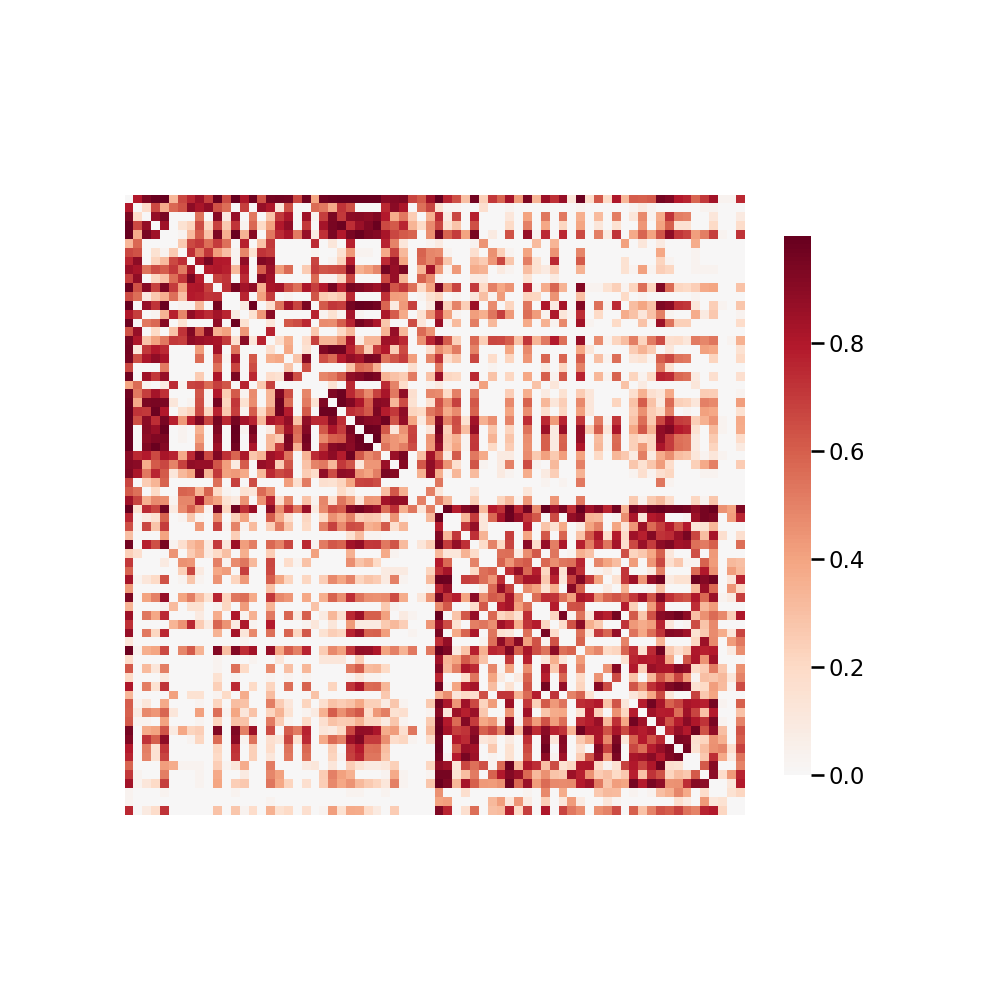

.. m2g_data documentation master file, created by
   sphinx-quickstart on Tue Mar 10 15:24:51 2020.
   You can adapt this file completely to your liking, but it should at least
   contain the root `toctree` directive.

******************
UPSM1
******************

Overview
-----------

UPSM - University of Pittsburgh School of Medicine

See http://fcon_1000.projects.nitrc.org/indi/CoRR/html/upsm_1.html for the website of the original dataset

**Sample Connectome** from BNU1-sub-0025866_ses-1-connectome

All Data Download Instructions
-------------------------------------

Download from S3

The most recently published snapshot can be downloaded from S3. This method is best for larger datasets or unstable connections. This example uses AWS CLI: https://aws.amazon.com/cli/?nc1=h_ls/ ::

	aws s3 sync --no-sign-request s3://openneuro.org/ds000201 ds000201-download/

(link above is fake, we will do it later)

Single Sample Download Instructions
----------------------------------------

sub-000201   ::
	**aws s3 sync --no-sign-request s3://openneuro.org/ds000201 ds000201-download/**

(link above is fake, we will do it later)

